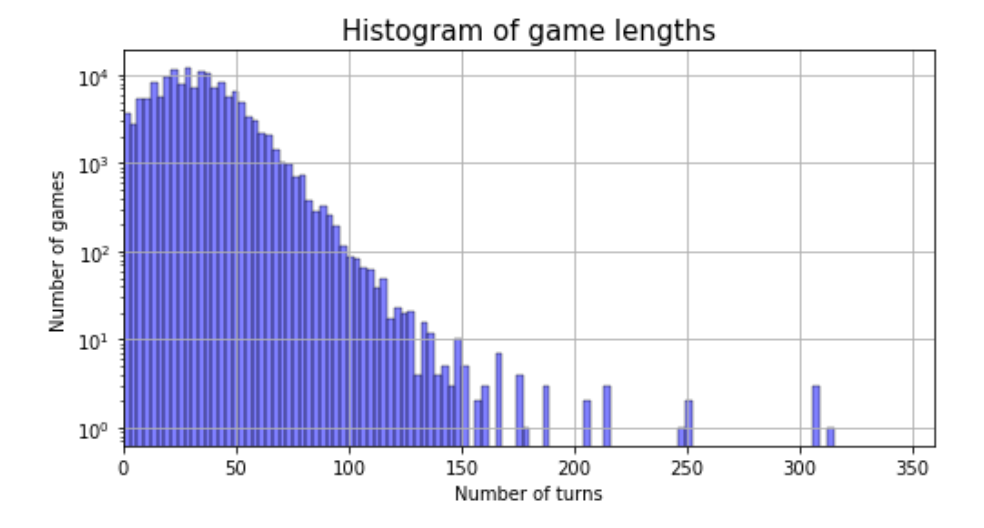

> “The saddest thing about betrayal is that it never comes from your enemies.”

Alliance, friendships, common interests but also trickery, deception, and betrayal shape our human interactions offline and online. 

Deciphering human behaviors is an arduous task, especially in the real world, as the consequences and their extent are interlinked to a myriad of confounding factors. So, let's take a step back and focus on what might seem a simpler scenario: a game. 

Unlike in our daily lives, in a game, there are explicit rules, parameters, and a defined time frame. However, the online game we chose for our analysis is no Disneyland, and happy-endings don't exist in [Diplomacy](https://www.playdiplomacy.com/). To quote its founders,

*"Luck plays no part in Diplomacy. Cunning and cleverness honesty and perfectly-timed betrayal are the tools needed to outwit your fellow players. The most skillful negotiator will climb to victory over the backs of both enemies and friends. Who do you trust?"*

The [dataset](https://data.world/maxstrange/diplomacyboardgame) we chose for our analysis consists of 21'197 different games from the web-based implementation of Diplomacy. Each of the seven players' main goal is to conquer Europe by making deals and alliances to control at least 18 supply centers and win the game. As shown in the following figures, most of the games last between 19 and 43 turns.

> “For there to be betrayal, there would have to have been trust first.” – Suzanne Collins 

Now that we have the basics in mind, enough words. Let’s focus on the acts. We identify two types of acts: *acts of friendship* (also named *friendly* *actions*) and *acts of hostility* (also named *hostile actions*).

🤝 An act of friendship in Diplomacy corresponds to a successful *support* order. This game mechanism allows players to help each other and provides unequivocal evidence of friendship.

⚔️ Acts of hostility in Diplomacy are not explicitly defined. For this analysis, hostile actions correspond to a player invading another one’s territory. 

We randomly draw 500 games from the dataset (as processing the entire dataset to find all the acts of friendship and hostility would take us days). We see that there are way more hostile actions than friendly actions, which seems logical given the game.

Like in real life, making friends is hard. One or two acts of friendships aren’t enough to become allies. We consider two players as friends if their relationship contains at least two consecutive and reciprocated acts of friendship that span at least four seasons in game time. 

As shown in the figure above, almost half of the 500 randomly sampled games don’t include a single friendship. Around a third of the games have only one friendship between two players. Less than 15% of the games contain two or more friendships.

Becoming friends is a good start, but staying friends is an even more challenging task! In order to win the games, players can stab their allies in the back (... dramatic drum rolls…) ! 

But how do we define a betrayal? Two definitions can be proponed:

1. betrayals are established and reciprocal friendships (as defined previously) that end with at least two hostile acts (N=2)
2. betrayals are established and reciprocal friendships that end with at least one hostile acts (N=1)

**⚠️ From now on, we only focus on games with friendships, as it’s the only scenario where a betrayal can occur.**

We therefore created a new subset from the original dataset. This time, we randomly sampled 500 games with at least one friendship. As shown in the figure above, for N=1, we notice that only 318 (i.e., 36,4%) of the friendships don’t eventually end with a betrayal!

However, “serial betrayers” are quite rare. In more than 500 friendships, only 10 players (i.e., around 3% of the betrayers) betrayed twice their allies, and 0 players committed more than 2 betrayals. In addition, only one player has been both the betrayer and the victim. 

>  “Some people are willing to betray years of friendship just to get a little bit of the spotlight.” – Lauren Conrad

We’re now more familiar with the main trends regarding friendships and betrayals among players in our dataset. It’s time to change gears and analyze the data from a different perspective: winners vs. losers. 

We first divide the players into two groups:

- a player is “single” if he/she was not engaged in a friendship during the game
- a player is “engaged” if he/she was friends with another player at some point during the game

As shown in the following figure, winners are mostly players that were engaged in a friendship, whereas losers are often “single”. 

If we plot the same graph but this time, focusing exclusively on players that were engaged in a friendship, we notice that there are way more “neutral” players, i.e., BFFs that never betrayed each other in the losers than in the winners group. 

If we compare the proportion of winners among each of these 4 types of players (single / betrayer / betrayed / neutral), the results are even more striking! Being engaged in a friendship at some point in the game correlates with a higher probability of winning, but players involved in a betrayal have even more chances of winning (even though they are the ones who were betrayed). 

However, we must be cautious in our claims as this strategy game is very complex, and there are numerous potential confounding factors. From our analysis, we can only say that cooperating during the game with your bestie doesn't seem to correlate with high chances of winning compared to betraying him/her, but it's still better than having no allies!

If we look at the final scores of each type of players that were engaged in a friendship, we see again that betrayers have a significantly higher score at the end of the games. The victims of a betrayal fare quite well with some exceeding the score of 18 required to win the game. Being betrayed doesn’t imply a systematic defeat.

> "If you cannot predict the betrayal from the ones that you love and trust the most, then you are living in a fool's paradise.” Lionel Suggs

Until now, we extracted insights from the dataset using a descriptive approach. Let’s take our analysis one step further by not only characterizing betrayals but also predicting them.

We create a classifier to predict at season x if a betrayal will occur at season x+1, i.e., during the next season. As we want to estimate the chance of an event occurring (a betrayal in our case), we choose a logistic regression model.

Regarding the parameters, we provide our model with the following features that we considered relevant: 

- the length of the friendship at this season, 
- the number of acts of hostility perpetrated by each player in the friendship to other players that are not in this relationship
- the number of acts of support by each player in the friendship to other players that are not in this relationship
- the average number of mutual supports of the two allies towards each other for the last three seasons

If we give our trained classifier a new dataset of 20 games with at least one season per game corresponding to a betrayal, we obtain an accuracy of around 85%. That sounds great, doesn’t it? But, wait a minute, we need to remember that our two classes: seasons where a betrayal is about to occur and seasons where no betrayal is about to occur, are highly unbalanced! Even though there is at least one betrayal per game, there are way more seasons with no betrayals than seasons with a betrayal.

If we look at the confusion matrix above, we see that only 4 betrayals (true label = 1) have been correctly classified as a betrayal ! The 18 others were misclassified. Plus, 22 seasons that don’t precede a betrayal were classified as if a betrayal was about to occur. 

Therefore, our classifier doesn’t do a good job. It’s better than a dummy estimator that would generate random predictions based on the training set class distribution (which has 77% of its seasons that aren’t followed by a betrayal). But, it’s worse than a classifier that would always predict the most frequent class of our training set (in our case, “no betrayal will occur during the next season”), which would yield an 87.5% accuracy. 

Designing better features, performing cross-validation for feature selection, and training a more complex classifier are some ideas we could explore to obtain a better classifier. 

### In a nutshell

To sum up, we have seen that friendships are difficult to build in Diplomacy and even harder to maintain. However, we were surprised to realize that betrayals seem quite profitable (i.e., correlated to a higher win ratio) even though we cannot determine whether it is the betrayal or other unknown factors that cause the observed increase. And this is true for both the betrayer and the betrayed players. Nevertheless, before betraying our friends in our daily lives, we must remember that this is true in a strategy game and may not apply to IRL human relationships. 

Last but not least, predicting a betrayal is even trickier. Our simple linear classifier was definitely not up to the task. However, this is not surprising, as we humans also have trouble completing this classifying task. 
